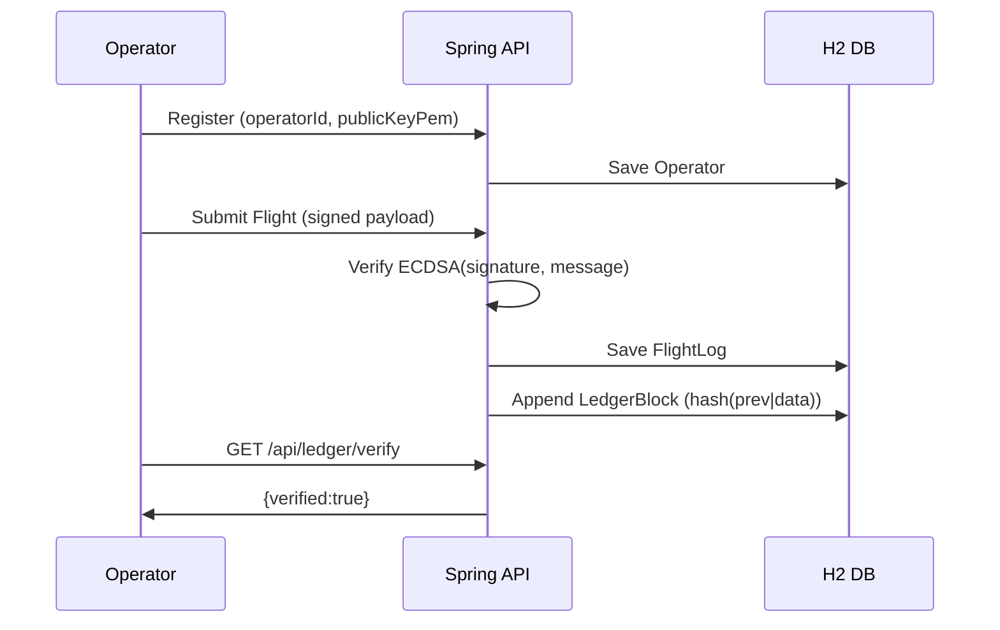
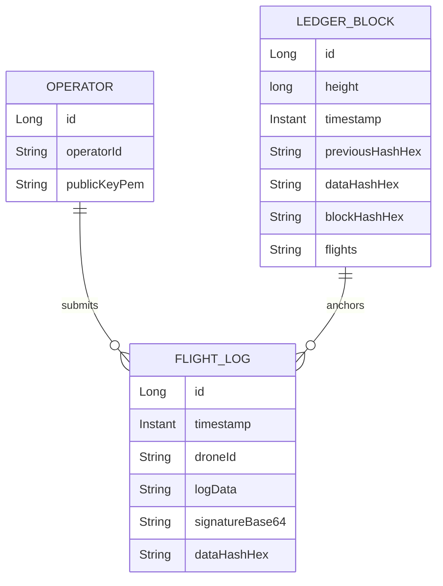

# Architecture Diagrams

```mermaid
sequenceDiagram
  participant Op as Operator
  participant API as Spring API
  participant DB as H2 DB
  Op->>API: Register (operatorId, publicKeyPem)
  API->>DB: Save Operator
  Op->>API: Submit Flight (signed payload)
  API->>API: Verify ECDSA(signature, message)
  API->>DB: Save FlightLog
  API->>DB: Append LedgerBlock (hash(prev|data))
  Op->>API: GET /api/ledger/verify
  API->>Op: {verified:true}
```

```mermaid
erDiagram
  OPERATOR ||--o{ FLIGHT_LOG : submits
  LEDGER_BLOCK ||--o{ FLIGHT_LOG : anchors

  OPERATOR {
    Long id
    String operatorId
    String publicKeyPem
  }

  FLIGHT_LOG {
    Long id
    Instant timestamp
    String droneId
    String logData
    String signatureBase64
    String dataHashHex
  }

  LEDGER_BLOCK {
    Long id
    long height
    Instant timestamp
    String previousHashHex
    String dataHashHex
    String blockHashHex
    String flights
  }
```
